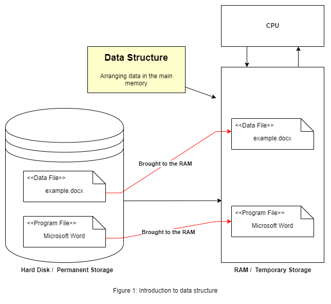
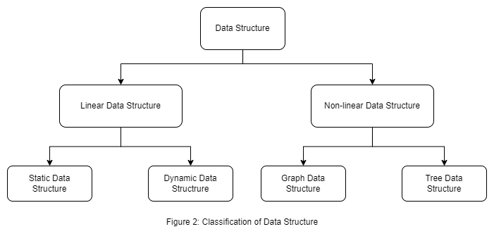

# Data Structure and Algorithm Notebook

A complete data structures and algorithms notebook with implemented (NodeJS) codes and problem solving. To see the codes, theory, or problems go to the directory.

## Part 1: Data Structure

### Introduction

Data structure is a way of arranging data so that it can be accessed, updated, and deleted at a low cost. Data structure is also used for data processing, storing, and retrieving. To build an efficient program, we might need to use data structure properly. The right data structure boosts the performance of a program broadly.

To understand data structure let's use an example. When a program (suppose, the program is Microsoft word) is been executing in the system or computer. The operating system brings docx file along with the program file itself to the main memory (RAM) from permanent storage (HDD or SSD), to execute the program. The data or docx file is stored in RAM in a way so that it can be accessed by the program file (MS Word) efficiently. Organizing/arranging that data in the main memory is the data structure.

  

**Structure in simple words:** Suppose an application, where users purchase railway tickets online. It has to process the ticket request which came first. Suppose total seats of a train is 10. Now, 11 people have requested for a seat. The application have to accept only first 10 request and reject the last one. So, there the application have to use First In First Out (FIFO) structure to find out which 10 users will get the ticket. There structure means a set of rules that holds the data together.

`So, we can say arranging data in a set of rules is data structure.`[3] For example array, set, object in javascript, dictionary and tuple in python, etc. are data structures. Each of the data structure has its own rules; how data will be stored, retrieved, modified, deleted is different in different data structure.

### Classification of Data Structure

There are mainly two types of data structure. Linear and Non-linear data structure. The following figure shows a basic classification of data structure visually.

  

**Linear Data Structure:** Linear data structure is the data structure where data elements are stored next to each other. In other words, linear data structure is the data structure in which elements are arranged sequentially or linearly.[1]

## Introduction to Algorithms

## References

1. [Geeks for Geeks](https://www.geeksforgeeks.org/)
2. [Udemy course by Abdul Bari sir](https://www.udemy.com/course/datastructurescncpp/)
3. [Data Structures a Pseudocode Approach with C by Richard F. Gilberg & Behrouz A. Forouzan](https://www.amazon.com/Data-Structures-Pseudocode-Approach-C/dp/0534390803)
