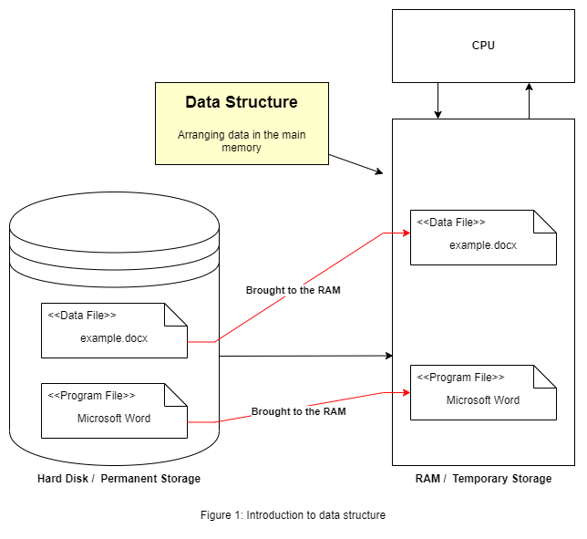
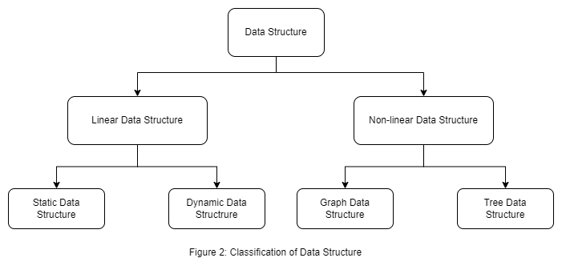

# Data Structure and Algorithm Notebook

A complete data structures and algorithms notebook with implemented (C++) codes and problem solutions. To see the codes, theory, or problems go to the directories.

## Section 0: Basic Concepts

Before studying data structures and algorithms, there are a few concepts that are required to be clear. Such as pseudocode, recursion, pointer, time and space complexity, and memory layout in c/c++. The details portion of this section is in the [`0-basic-concepts`](0-basic-concepts/README.md) folder.

## Section 1: Data Structure

### Introduction

Data structure is a way of arranging data so that it can be accessed, updated, and deleted at a low cost. Data structure is also used for data processing, storing, and retrieving. To build an efficient program, we might need to use data structure properly. The right data structure boosts the performance of a program broadly.

To understand data structure let's use an example. When a program (suppose, the program is Microsoft word) is been executing in the system or computer. The operating system brings docx file along with the program file itself to the main memory (RAM) from permanent storage (HDD or SSD), to execute the program. The data or docx file is stored in RAM in a way so that it can be accessed by the program file (MS Word) efficiently. Organizing/arranging that data in the main memory is the data structure.[2]

  

**Structure in simple words:** Suppose an application, where users purchase railway tickets online. It has to process the ticket request which came first. Suppose total seats of a train is 10. Now, 11 people have requested for a seat. The application have to accept only first 10 request and reject the last one. So, there the application have to use First In First Out (FIFO) structure to find out which 10 users will get the ticket. There structure means a set of rules that holds the data together.[3]

> So, we can say arranging data in a set of rules is data structure. For example array, set, object in javascript, dictionary and tuple in python, etc. are data structures. Each of the data structure has its own rules; how data will be stored, retrieved, modified, deleted is different in different data structures.

### Classification of Data Structure

There are mainly two types of data structure. Linear and Non-linear data structure. The following figure shows a basic classification of data structure visually.

  

- **Linear Data Structure:** Linear data structure is the data structure, where data elements are stored next to each other. In other words, the linear data structure is the data structure in which elements are arranged sequentially or linearly.[1] As computer memory is arranged in a linear way, linear data structures are easy to implement. All the elements of linear data structure can be traversed in a single run only. The linear data structure can be divided into two parts. Static and dynamic data structure.

  - **Static Data Structure:** Static data structures have fixed memory sizes.[1] The array is the right example of static data structure. The array has a fixed memory size. We need to specify the number representing the total elements count of the array while initializing it. We cannot remove an element or append more elements to an array than its size capacity. Because of this behavior array is a static data structure.
  - **Dynamic Data Structure:** Unlike static data structures, in dynamic data structures, size is not fixed.[1] Its size can be updated during runtime. Linked list is an example of a dynamic data structure. In the linked list, we do not need to specify the size of the collection while initializing it. Its size can be increased or decreased during runtime.
- **Non-linear Data Structure:** In non-linear data structures, data elements are not arranged in a sequential way. Data is arranged in a hierarchical manner. Where one element can be connected to one or multiple elements. When programs become complex, non-linear data structures might perform better than linear data structures.[4] Non-linear data structures can be divided into graph and tree based data structures.

Difference between linear and non-linear data structure in simple words.
| Linear Data Structure                                                | Non-linear Data Structure                                         |
| -------------------------------------------------------------------- | ----------------------------------------------------------------- |
| Size is fixed                                                        | Size is not fixed                                                 |
| Single level is involved                                             | Multiple levels are involved                                      |
| All elements can be traversed in a single run only                   | All elements cannot be traversed in a single run only             |
| Easy implementation compared to the non-linear data structure        | Implementation is complex compared to the linear data structure   |
| In linear data structure, memory is not utilized in an efficient way | In non-linear data structure, memory utilized in an efficient way |

## References

1. [Geeks for Geeks](https://www.geeksforgeeks.org/)
2. [Udemy course by Abdul Bari sir](https://www.udemy.com/course/datastructurescncpp/)
3. [Data Structures a Pseudocode Approach with C by Richard F. Gilberg & Behrouz A. Forouzan](https://www.amazon.com/Data-Structures-Pseudocode-Approach-C/dp/0534390803)
4. [Data Structure and Types - Programiz](https://www.programiz.com/dsa/data-structure-types)
